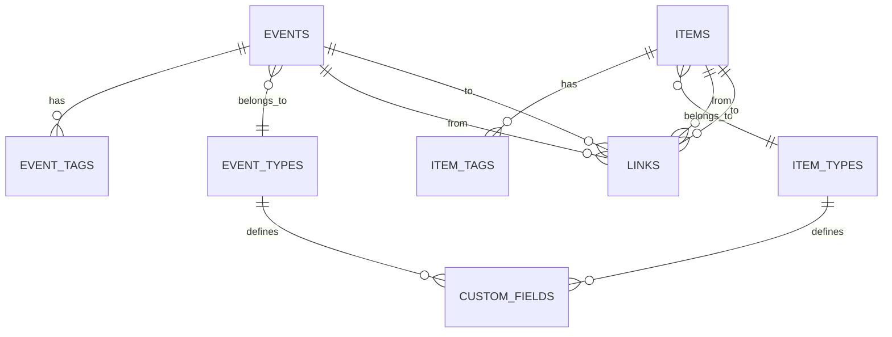
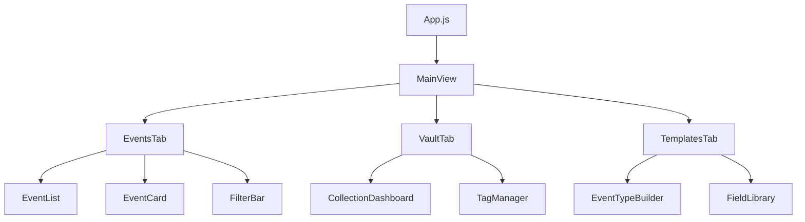
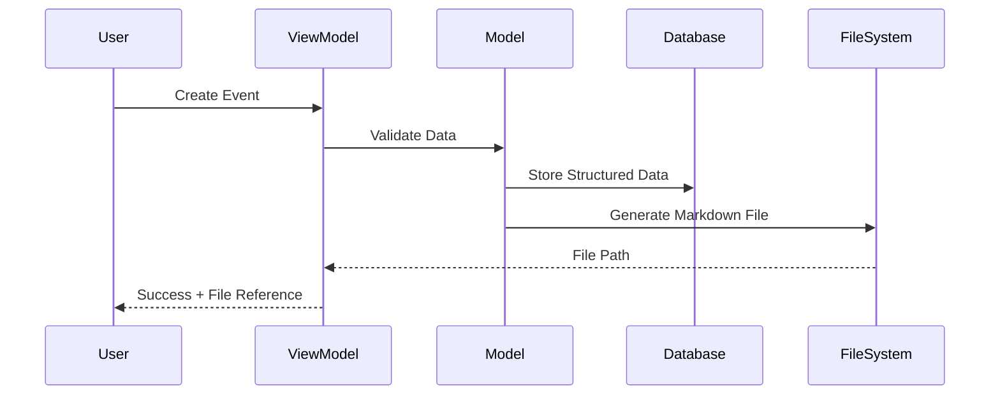

# Documentation Plan & Autodocumentation Guide
*A comprehensive strategy for maintaining living documentation throughout development*

## Documentation Philosophy

**Core Principle**: Documentation should be **automatic**, **contextual**, and **living** - updating as the code evolves without requiring separate maintenance effort.

**Target Audiences**:
- **Future You** - Understanding decisions and architecture 6 months later
- **Team Members** - Onboarding and collaboration
- **Users** - API usage and feature understanding
- **Stakeholders** - Architecture decisions and progress

---

## 1. Code Documentation (Automatic)

### JSDoc Setup for JavaScript Modules

**Purpose**: Auto-document your ViewModels, Models, and core logic

**Installation**:
```bash
npm install -g jsdoc
npm install --save-dev jsdoc-to-markdown
```

**Configuration** (`jsdoc.json`):
```json
{
  "source": {
    "include": ["./src/"],
    "includePattern": "\\.(js|jsx)$",
    "excludePattern": "node_modules/"
  },
  "opts": {
    "destination": "./docs/api/",
    "recurse": true
  },
  "plugins": ["plugins/markdown"],
  "templates": {
    "cleverLinks": false,
    "monospaceLinks": false
  }
}
```

**Usage Pattern** (in your existing code):
```javascript
/**
 * Creates a new event with validation and automatic markdown file generation
 * @class EventViewModel
 * @description Manages event creation, validation, and database operations
 * following the Universal Field System architecture
 */
class EventViewModel {
    /**
     * Creates a new event with bidirectional sync to markdown
     * @param {Object} eventData - Event data following custom field schema
     * @param {string} eventData.title - Event title (required)
     * @param {string} eventData.content - Event content (required)
     * @param {number} eventData.event_type_id - Reference to custom event type
     * @param {Object} eventData.custom_fields - Dynamic fields based on event type
     * @returns {Promise<Event>} Created event with auto-generated file_path
     * @throws {Error} When title/content missing or validation fails
     * @example
     * const event = await eventVM.createEvent({
     *   title: "Doctor Appointment",
     *   content: "Annual checkup",
     *   event_type_id: 2,
     *   custom_fields: { location: "Downtown Clinic", cost: 150 }
     * });
     */
    async createEvent(eventData) {
        // Implementation here
    }
}
```

**Auto-generation Commands**:
```bash
# Generate HTML documentation
jsdoc -c jsdoc.json

# Generate markdown for README inclusion
jsdoc2md "src/**/*.js" > docs/api/API.md

# Watch mode during development
jsdoc -c jsdoc.json --watch
```

### TypeScript-style Documentation (Enhanced JSDoc)

**Enhanced type checking without TypeScript**:
```javascript
/**
 * @typedef {Object} CustomField
 * @property {string} name - Field name matching field library
 * @property {string} type - text|number|date|select|multiselect
 * @property {*} value - Field value matching the type
 * @property {boolean} required - Whether field is required
 */

/**
 * @typedef {Object} EventType
 * @property {number} id - Unique identifier
 * @property {string} name - Display name for event type
 * @property {CustomField[]} custom_fields - Array of custom field definitions
 * @property {string} template - Markdown template for auto-generation
 */
```

---

## 2. Architecture Documentation (Visual + Text)

### Mermaid Diagrams in Markdown

**Purpose**: Keep visual documentation in sync with your existing markdown specs

**Installation** (VS Code):
- Install "Mermaid Preview" extension
- Diagrams render in GitHub/GitLab automatically

**Usage in your existing docs**:

**Database Relationships** (`docs/architecture/DATABASE_RELATIONSHIPS.md`):
```markdown
## Entity Relationship Diagram



**UI Component Hierarchy** (`docs/architecture/UI_COMPONENTS.md`):


**Data Flow Architecture**:


### Auto-generated Architecture Docs

**Dependency Analysis**:
```bash
npm install -g madge

# Generate dependency graphs
madge --image deps.png src/
madge --circular src/  # Find circular dependencies
madge --summary src/   # Generate summary stats
```

**File Structure Documentation**:
```bash
# Auto-generate file tree documentation
tree src/ > docs/architecture/FILE_STRUCTURE.md

# Or with descriptions
find src/ -name "*.js" -exec echo "## {}" \; -exec head -5 {} \; > docs/api/MODULE_OVERVIEW.md
```

---

## 3. Database Documentation (Schema + Examples)

### Auto-generated Schema Documentation

**SQL Schema Documentation** (add to your existing db.js):
```javascript
/**
 * Database Schema Documentation
 * Auto-generated from Dexie schema definitions
 */
class DatabaseDocumenter {
    static generateSchemaDocs() {
        const schemas = {};
        
        Object.keys(db._allTables).forEach(tableName => {
            const table = db[tableName];
            schemas[tableName] = {
                primaryKey: table.schema.primKey.name,
                indexes: table.schema.indexes.map(idx => idx.name),
                relationships: this.findRelationships(tableName)
            };
        });
        
        return schemas;
    }
    
    static async generateSampleData() {
        // Generate example data for documentation
        const examples = {};
        
        for (let tableName of Object.keys(db._allTables)) {
            const sample = await db[tableName].limit(1).toArray();
            if (sample.length > 0) {
                examples[tableName] = sample[0];
            }
        }
        
        return examples;
    }
}
```

**Usage**:
```javascript
// In your development console or test file
const schemaDocs = DatabaseDocumenter.generateSchemaDocs();
const examples = await DatabaseDocumenter.generateSampleData();

console.log('Schema Documentation:', JSON.stringify(schemaDocs, null, 2));
console.log('Example Data:', JSON.stringify(examples, null, 2));
```

### Query Documentation

**Document your common queries** (in existing ViewModels):
```javascript
/**
 * Collection Query Language (CQL) Examples
 * Auto-documented from actual implementation
 */
class QueryDocumenter {
    /**
     * Get events by collection filter
     * @example
     * // Health collection: events with health tags due this week
     * const healthEvents = await this.getEventsByCollection({
     *   tags: ['health', 'medical'],
     *   due_date: { '>=': startOfWeek, '<=': endOfWeek },
     *   priority: { '>=': 3 }
     * });
     */
    async getEventsByCollection(filter) {
        // Your implementation
    }
}
```

---

## 4. Real-time Documentation (As You Code)

### VS Code Extensions Setup

**Install these extensions**:
```json
{
  "recommendations": [
    "aaron-bond.better-comments",
    "mintlify.document",
    "streetsidesoftware.code-spell-checker",
    "bierner.markdown-mermaid",
    "shd101wyy.markdown-preview-enhanced"
  ]
}
```

**Better Comments Configuration** (`.vscode/settings.json`):
```json
{
  "better-comments.tags": [
    {
      "tag": "!",
      "color": "#FF2D00",
      "strikethrough": false,
      "underline": false,
      "backgroundColor": "transparent",
      "bold": false,
      "italic": false
    },
    {
      "tag": "?",
      "color": "#3498DB",
      "strikethrough": false,
      "underline": false,
      "backgroundColor": "transparent",
      "bold": false,
      "italic": false
    },
    {
      "tag": "//",
      "color": "#474747",
      "strikethrough": true,
      "underline": false,
      "backgroundColor": "transparent",
      "bold": false,
      "italic": false
    },
    {
      "tag": "TODO",
      "color": "#FF8C00",
      "strikethrough": false,
      "underline": false,
      "backgroundColor": "transparent",
      "bold": false,
      "italic": false
    },
    {
      "tag": "FIXME",
      "color": "#FF2D00",
      "strikethrough": false,
      "underline": false,
      "backgroundColor": "transparent",
      "bold": false,
      "italic": false
    },
    {
      "tag": "ARCH",
      "color": "#9b59b6",
      "strikethrough": false,
      "underline": false,
      "backgroundColor": "transparent",
      "bold": false,
      "italic": false
    }
  ]
}
```

**Usage in your code**:
```javascript
// ! CRITICAL: This affects bidirectional sync between markdown and database
// ? QUESTION: Should we validate custom fields here or in the model?
// TODO: Add support for nested custom fields in Universal Field System
// FIXME: Memory leak when disposing event listeners
// ARCH: Following the Data Ownership First principle from UI_UX_SPECIFICATION.md

class EventViewModel {
    // Your implementation
}
```

### Automated TODO/FIXME Tracking

**Create a script** (`scripts/extract-todos.js`):
```javascript
const fs = require('fs');
const path = require('path');

function extractTodos(dir) {
    const todos = [];
    
    function scanFile(filePath) {
        const content = fs.readFileSync(filePath, 'utf8');
        const lines = content.split('\n');
        
        lines.forEach((line, index) => {
            const match = line.match(/(TODO|FIXME|ARCH|QUESTION):\s*(.*)/);
            if (match) {
                todos.push({
                    type: match[1],
                    message: match[2],
                    file: filePath,
                    line: index + 1,
                    context: line.trim()
                });
            }
        });
    }
    
    function scanDirectory(dirPath) {
        const items = fs.readdirSync(dirPath);
        
        for (const item of items) {
            const fullPath = path.join(dirPath, item);
            const stat = fs.statSync(fullPath);
            
            if (stat.isDirectory() && !item.startsWith('.') && item !== 'node_modules') {
                scanDirectory(fullPath);
            } else if (item.endsWith('.js') || item.endsWith('.md')) {
                scanFile(fullPath);
            }
        }
    }
    
    scanDirectory(dir);
    return todos;
}

// Generate TODO documentation
const todos = extractTodos('./src');
const markdown = generateTodoMarkdown(todos);
fs.writeFileSync('./docs/development/TODOS.md', markdown);

function generateTodoMarkdown(todos) {
    let md = '# Development TODOs\n\n';
    
    const grouped = todos.reduce((acc, todo) => {
        if (!acc[todo.type]) acc[todo.type] = [];
        acc[todo.type].push(todo);
        return acc;
    }, {});
    
    Object.entries(grouped).forEach(([type, items]) => {
        md += `## ${type}\n\n`;
        items.forEach(item => {
            md += `- **${item.file}:${item.line}** - ${item.message}\n`;
        });
        md += '\n';
    });
    
    return md;
}
```

**Add to package.json**:
```json
{
  "scripts": {
    "docs:todos": "node scripts/extract-todos.js",
    "docs:generate": "npm run docs:todos && jsdoc -c jsdoc.json"
  }
}
```

---

## 5. Project Documentation (High-level)

### Automated README Generation

**Template** (`.readme/template.md`):
```markdown
# {{name}}
{{description}}

## Architecture Overview

{{architecture_summary}}

## Quick Start

{{quick_start}}

## API Documentation

{{api_links}}

## Development Status

Last updated: {{date}}
Total TODOs: {{todo_count}}
Test Coverage: {{coverage}}

## Recent Changes

{{changelog}}
```

**Generation Script** (`scripts/generate-readme.js`):
```javascript
const fs = require('fs');
const { execSync } = require('child_process');

function generateReadme() {
    const packageJson = JSON.parse(fs.readFileSync('./package.json'));
    const todos = require('./extract-todos')('./src');
    
    const template = fs.readFileSync('./.readme/template.md', 'utf8');
    
    const replacements = {
        name: packageJson.name,
        description: packageJson.description,
        date: new Date().toISOString().split('T')[0],
        todo_count: todos.length,
        architecture_summary: generateArchSummary(),
        api_links: generateApiLinks(),
        quick_start: generateQuickStart(),
        changelog: generateChangelog()
    };
    
    let readme = template;
    Object.entries(replacements).forEach(([key, value]) => {
        readme = readme.replace(new RegExp(`{{${key}}}`, 'g'), value);
    });
    
    fs.writeFileSync('./README.md', readme);
}
```

### Changelog Automation

**Using conventional commits**:
```bash
npm install -g conventional-changelog-cli

# Generate changelog from commit messages
conventional-changelog -p angular -i CHANGELOG.md -s

# Or auto-generate from git tags
git-changelog --tag=$(git describe --tags --abbrev=0)
```

### Progress Tracking

**Feature completion script** (`scripts/track-progress.js`):
```javascript
function trackProgress() {
    const features = extractFeaturesFromSpecs();
    const implemented = checkImplementationStatus();
    
    const progress = features.map(feature => ({
        name: feature.name,
        status: implemented.includes(feature.name) ? '✅' : '⏳',
        description: feature.description
    }));
    
    generateProgressReport(progress);
}
```

---

## 6. Integration & Automation

### Git Hooks for Auto-documentation

**Pre-commit hook** (`.husky/pre-commit`):
```bash
#!/bin/sh
# Auto-generate documentation before commit

npm run docs:generate
git add docs/

# Update README if package.json changed
if git diff --cached --name-only | grep -q "package.json"; then
    npm run docs:readme
    git add README.md
fi
```

### CI/CD Documentation Updates

**GitHub Actions** (`.github/workflows/docs.yml`):
```yaml
name: Update Documentation

on:
  push:
    branches: [main]

jobs:
  docs:
    runs-on: ubuntu-latest
    steps:
      - uses: actions/checkout@v2
      
      - name: Setup Node.js
        uses: actions/setup-node@v2
        with:
          node-version: '16'
          
      - name: Install dependencies
        run: npm install
        
      - name: Generate documentation
        run: |
          npm run docs:generate
          npm run docs:todos
          npm run docs:readme
          
      - name: Deploy to GitHub Pages
        uses: peaceiris/actions-gh-pages@v3
        with:
          github_token: ${{ secrets.GITHUB_TOKEN }}
          publish_dir: ./docs
```

### Documentation Health Checks

**Validation script** (`scripts/validate-docs.js`):
```javascript
function validateDocumentation() {
    const checks = [
        checkAPIDocCoverage(),
        checkMarkdownLinks(),
        checkCodeExamples(),
        checkArchitectureAlignment()
    ];
    
    const failed = checks.filter(check => !check.passed);
    
    if (failed.length > 0) {
        console.log('Documentation issues found:');
        failed.forEach(check => console.log(`- ${check.error}`));
        process.exit(1);
    }
}
```

---

## 7. Documentation Workflow

### Daily Development Workflow

1. **Code with intention comments**:
   ```javascript
   // ARCH: Implementing Universal Field System pattern
   // TODO: Add validation for nested custom fields
   ```

2. **Auto-generate docs on commit**:
   ```bash
   git commit -m "feat: add custom field validation"
   # Hook automatically updates JSDoc and TODOs
   ```

3. **Weekly review**:
   ```bash
   npm run docs:validate  # Check documentation health
   npm run docs:todos     # Review outstanding TODOs
   ```

### Architecture Decision Records (ADRs)

**Template** (`docs/architecture/adr/template.md`):
```markdown
# ADR-XXX: [Title]

Date: YYYY-MM-DD
Status: Proposed | Accepted | Deprecated | Superseded

## Context
What is the issue that we're seeing that is motivating this decision or change?

## Decision
What is the change that we're proposing or have agreed to implement?

## Consequences
What becomes easier or more difficult to do and any risks introduced by the change that will need to be mitigated.

## Implementation Notes
Technical details about how this will be implemented.

## References
- Links to related discussions, code, or specifications
```

### Documentation Review Process

**Before major releases**:
1. Run `npm run docs:validate`
2. Review and close completed TODOs
3. Update architecture diagrams if data model changed
4. Generate fresh API documentation
5. Update README with new features

---

## 8. Tools Summary

| Category | Tool | Purpose | Automation Level |
|----------|------|---------|------------------|
| **Code** | JSDoc | API documentation | High |
| **Code** | Better Comments | Intention tracking | Real-time |
| **Architecture** | Mermaid | Visual diagrams | Manual |
| **Database** | Custom scripts | Schema docs | Medium |
| **Project** | Conventional commits | Changelog | High |
| **Validation** | Custom scripts | Doc health | High |
| **Dependencies** | Madge | Architecture analysis | High |

## Getting Started

1. **Install core tools**:
   ```bash
   npm install -g jsdoc conventional-changelog-cli madge
   ```

2. **Set up VS Code extensions** (from recommendations above)

3. **Add scripts to package.json**:
   ```json
   {
     "scripts": {
       "docs:generate": "jsdoc -c jsdoc.json",
       "docs:todos": "node scripts/extract-todos.js",
       "docs:validate": "node scripts/validate-docs.js",
       "docs:readme": "node scripts/generate-readme.js"
     }
   }
   ```

4. **Start documenting with intention**:
   - Add JSDoc to your existing ViewModels
   - Use Better Comments for architecture notes
   - Add Mermaid diagrams to your existing specs

This documentation system will grow with your project, automatically capturing your architectural decisions and keeping your docs current as you develop.
