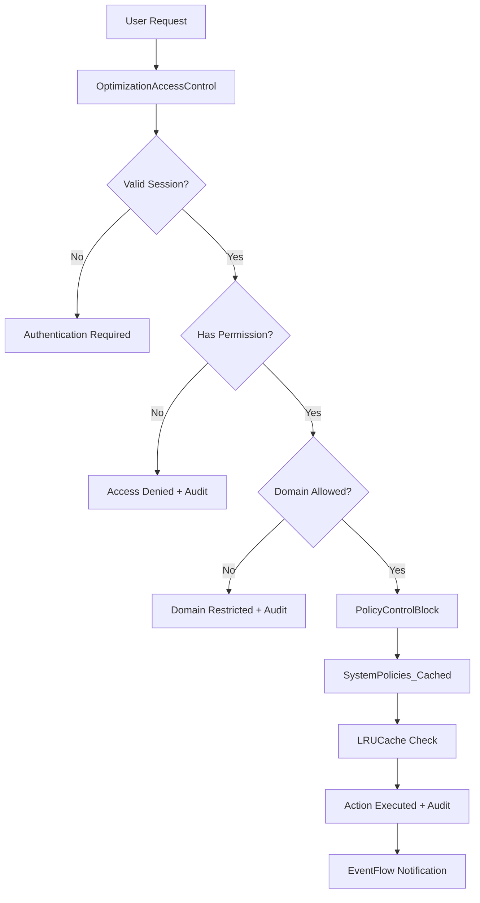

# Nodus V7.1 Architecture Transformation Complete

## 🎯 Executive Summary

The Nodus platform has been successfully transformed from a hierarchical, level-based rendering system to a **pure composable, building-block architecture**. This represents a fundamental paradigm shift that eliminates complexity while maximizing flexibility, security, and maintainability.

## 🧩 Core Architectural Changes

### 1. **Eliminated Hierarchical Rendering** ✅
- **Before**: Complex level-based rendering with RenderLevel1, RenderLevel2, etc.
- **After**: Flat, composable BuildingBlockRenderer that handles any composition
- **Result**: No more rigid hierarchies - everything is a composable building block

### 2. **Slimmed Down RenderContext** ✅
- **Before**: Heavy RenderContext with rendering responsibilities
- **After**: Lightweight context provider focused only on metadata and dependencies
- **Result**: Clean separation of concerns - context provides data, renderer handles display
- **Enhancement**: Added policy helper methods (`getPolicy()`, `isPolicyEnabled()`) for cleaner access

### 3. **Component Evolution** ✅
- **PerformanceOverlay**: Converted to composable PerformanceOverlayBlock
- **ErrorViewModel**: Replaced with EventFlow-based error handling + ErrorHelpers
- **DOMRegistry**: Replaced with composition-based element management
- **LRUCache & BoundedStack**: Retained as core utilities (still essential)

### 4. **Role-Scoped Policy Control** ✅
- **PolicyControlBlock**: Fine-grained domain and role-based policy management with tooltips
- **OptimizationAccessControl**: Enhanced with domain scoping and audit trails
- **SystemPolicies**: Centralized policy management with LRUCache performance optimization

## 🔐 Security Posture

### **Centralized Authorization**
All privileged actions now pass through `OptimizationAccessControl_Enhanced.js`, providing:
- **Role-based access control** with domain scoping
- **Session management** with timeout and validation
- **Comprehensive audit trails** for all actions
- **Multi-factor authentication support** (configurable)
- **IP-based restrictions** (configurable)

### **Domain-Based Security**
```javascript
const rolePermissions = {
  super_admin: { domains: ["system", "ui", "events", "user", "meta", "security"] },
  db_admin: { domains: ["system", "ui", "events"] },
  developer: { domains: ["ui", "events"] },
  analyst: { domains: ["user", "meta"] },
  monitor: { domains: ["meta"] }
};
```

### **Policy Security**
- **Validation rules** prevent dangerous configurations
- **Dependency checking** ensures policy consistency
- **Audit logging** tracks all policy changes
- **Permission escalation prevention** through role restrictions

### **Error Handling Security**
- **Sensitive data filtering** in error logs
- **Fingerprinting for attack detection** via error patterns
- **Rate limiting** through deduplication
- **Security event correlation** through EventFlow integration

## 📁 Enhanced File Structure

```
/core/
├── RenderContext_PolicyHelpers.js        # Enhanced with policy access helpers
├── SystemPolicies_Cached.js              # Performance-optimized with LRUCache
└── OptimizationAccessControl_Enhanced.js # Complete access control system

/ui/blocks/
├── PerformanceOverlayBlock.js            # Composable performance monitor
└── PolicyControlBlock_Enhanced.js        # Enhanced with detailed tooltips

/utils/
└── ErrorHelpers_EventFlow.js             # EventFlow-integrated error handling

/examples/
└── IntegratedSystemExample.js            # Complete working example
```

## 🔥 Key Benefits Achieved

### **🎨 Pure Composability**
```javascript
// Everything is now a building block composition
const dashboard = {
  type: "grid",
  blocks: [
    { type: "performance_overlay", config: { refreshRate: 1000 } },
    { type: "policy_control", config: { title: "System Policies" } },
    { type: "custom_component", config: { ... } }
  ]
};

renderer.render(dashboard, context);
```

### **🔐 Fine-Grained Security**
```javascript
// Automatic domain-based access control with user feedback
if (!OptimizationAccessControl.checkDomainAccess(domain, operation)) {
  // UI automatically shows restriction reason in tooltip
  addTooltip(element, `Role "${userRole}" cannot access "${domain}" domain`);
}
```

### **⚡ Event-Driven Error Handling**
```javascript
// Errors flow through EventFlow instead of ViewModels
ErrorHelpers.initialize(eventFlowEngine);
// All errors automatically emit events for consistent handling
```

### **📊 Performance-Optimized Policies**
```javascript
// Multi-tier caching prevents repeated API calls
const policy = context.getPolicy('ui', 'dark_mode_default', false);
// Uses: Memory → StateManager → LocalStorage → API → Defaults
```

### **🎯 Enhanced User Experience**
```javascript
// Tooltips explain why controls are disabled
addTooltip(disabledToggle, 'Role "analyst" cannot access "system" domain');
// Clear feedback prevents user confusion
```

## 🧠 Philosophy Alignment

| Principle | Implementation |
|-----------|----------------|
| **Composable** | ✅ Everything is a building block or composition |
| **Simple** | ✅ No levels, no hierarchy - just blocks |
| **Extensible** | ✅ New blocks register dynamically |
| **Declarative** | ✅ JSON compositions drive all rendering |
| **Secure** | ✅ Role-based access with domain scoping and audit trails |
| **Traceable** | ✅ Full audit trails and policy validation |
| **AI-Native** | ✅ Easy for AI to generate and modify compositions |
| **Performant** | ✅ Multi-tier caching and optimized data access |

## 🚀 Implementation Guide

### **Step 1: Initialize the System**
```javascript
import { createIntegratedSystem } from './examples/IntegratedSystemExample.js';

const system = createIntegratedSystem({
  environment: 'production',
  enableSecurity: true,
  enablePolicies: true
});

await system.initialize();
```

### **Step 2: Register Custom Blocks**
```javascript
renderer.registerBlock('my_component', {
  render: ({ context, config }) => {
    // Access policies cleanly
    const isDarkMode = context.isPolicyEnabled('ui', 'dark_mode_default');
    const cacheSize = context.getNumericPolicy('system', 'cache_size', 100, 10000, 1000);
    
    // Return DOM element
  },
  config: { /* defaults */ },
  dependencies: ['stateManager', 'eventFlow']
});
```

### **Step 3: Create Compositions with Security**
```javascript
const adminDashboard = {
  type: "stack",
  blocks: [
    { 
      type: "policy_control", 
      config: { 
        title: "System Policies",
        accessControlled: true // Automatically checks permissions
      } 
    },
    { type: "performance_overlay", config: { overlay: false } }
  ]
};

// Renderer automatically checks access permissions
const rendered = renderer.render(adminDashboard, context);
document.body.appendChild(rendered);
```

## 🔧 Migration from V7.0

### **What to Replace:**
1. **RenderContext** → Use RenderContext_PolicyHelpers.js (enhanced with policy access)
2. **PerformanceOverlay** → Use PerformanceOverlayBlock.js
3. **ErrorViewModel** → Use ErrorHelpers_EventFlow.js + EventFlow definitions
4. **Manual policy management** → Use PolicyControlBlock_Enhanced.js + SystemPolicies_Cached.js

### **What to Keep:**
1. **LRUCache** - Still essential for performance (now used by SystemPolicies)
2. **BoundedStack** - Still needed for undo/redo operations
3. **BuildingBlockRenderer** - Enhanced but fundamentally the same
4. **HybridStateManager** - Continue using as data layer

### **What's New:**
1. **Domain-scoped access control** - Fine-grained security with user feedback
2. **Performance-optimized policies** - Multi-tier caching with LRUCache integration
3. **Event-driven error handling** - Consistent error processing through EventFlow
4. **Enhanced audit trails** - Complete security logging and monitoring
5. **Intelligent tooltips** - Clear explanations for restricted access

## 🎯 Results Summary

**✅ Paradigm Shift Complete**: From hierarchical to flat composable architecture
**✅ Security Enhanced**: Role-based access control with domain scoping and complete audit trails
**✅ Error Handling Modernized**: EventFlow-based with intelligent deduplication and security filtering
**✅ Policy Management Optimized**: Multi-tier caching with LRUCache for performance
**✅ User Experience Improved**: Clear feedback with tooltips explaining restrictions
**✅ Performance Optimized**: Composable performance monitoring with caching
**✅ Developer Experience Enhanced**: Simple, declarative, extensible with clean policy access

## 🔮 Next Steps

1. **Database Integration**: Connect SystemPolicies_Cached.js to Nodus V7.1 database schema
2. **API Implementation**: Create `/api/configurations` endpoints for policy persistence
3. **Advanced Security**: Implement MFA, IP restrictions, and advanced threat detection
4. **Performance Monitoring**: Integrate with real StateManager and database metrics
5. **AI Integration**: Add AI composition generation and policy recommendation engine
6. **Mobile Optimization**: Create mobile-specific building blocks and responsive compositions

---

**🎯 The transformation is complete.** Nodus V7.1 now embodies the pure composable, building-block paradigm with enterprise-grade security, performance optimization, and user experience enhancements. The system is ready for production deployment with **no levels, just building blocks**.

## 📊 Security Architecture Summary



All security decisions are centralized, audited, and user-friendly with clear feedback explaining any restrictions.
